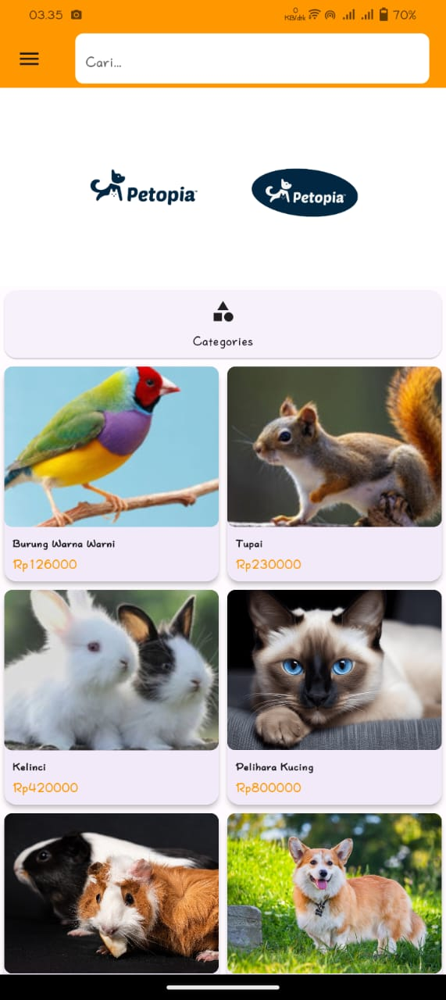
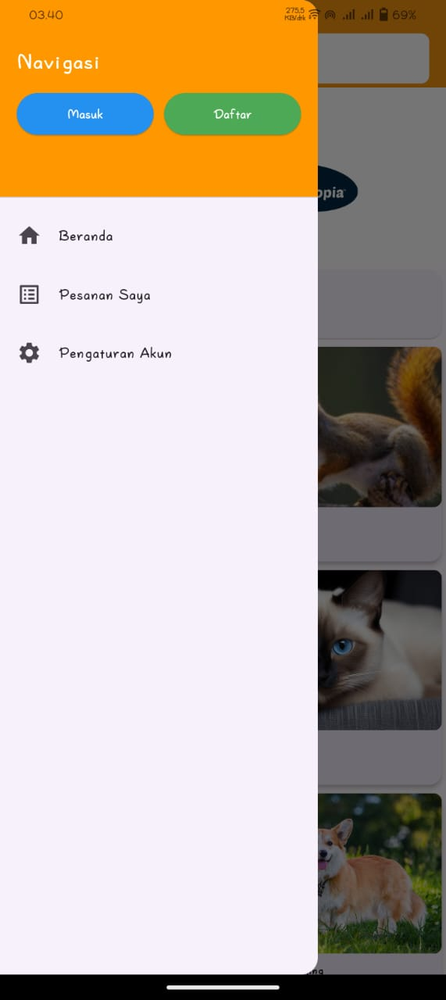
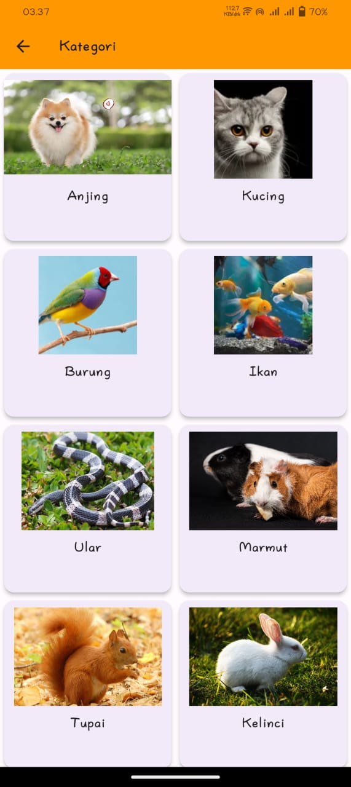
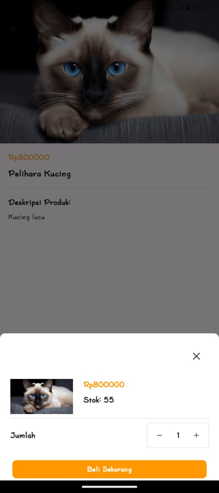
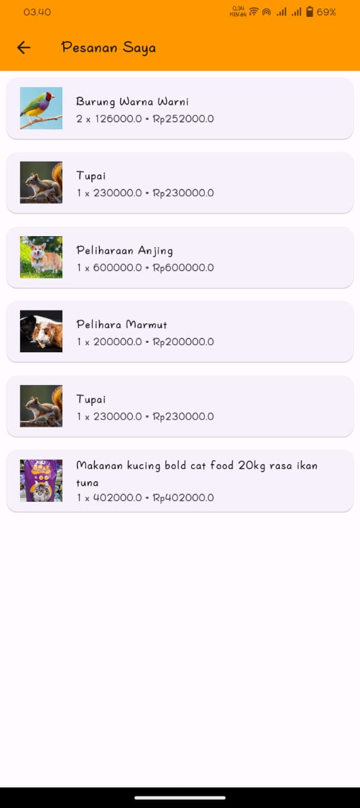

# pettopia

Project Aplikasi Flutter Pettopia. Merupakan project aplikasi penjualan hewan online. Project ini untuk memenuhi tugas akhir mata kuliah Pemrograman Mobile II.

## Tampilan Aplikasi

- Tampilan Login
  

- Tampilan Dashbord
  
  

- Tampilan Kategori
  

- Tampilan pembelian
  

- Tampilan Pesanan
  

## Requirement

- Flutter
- Dart Language
- Flutter Framework
- Android Studio IDE

## Instalation

cole aplikasi menggunakan kode berikut:
'''
git clone https://github.com/riosetiawann/ApkFlutter_Pettopia.git
'''

Masuk ke direktori project
...
cd ApkFlutter_Pettopia
...

install dependencies
...
flutter pub get
...

start aplikasi
...
flutter run
...
